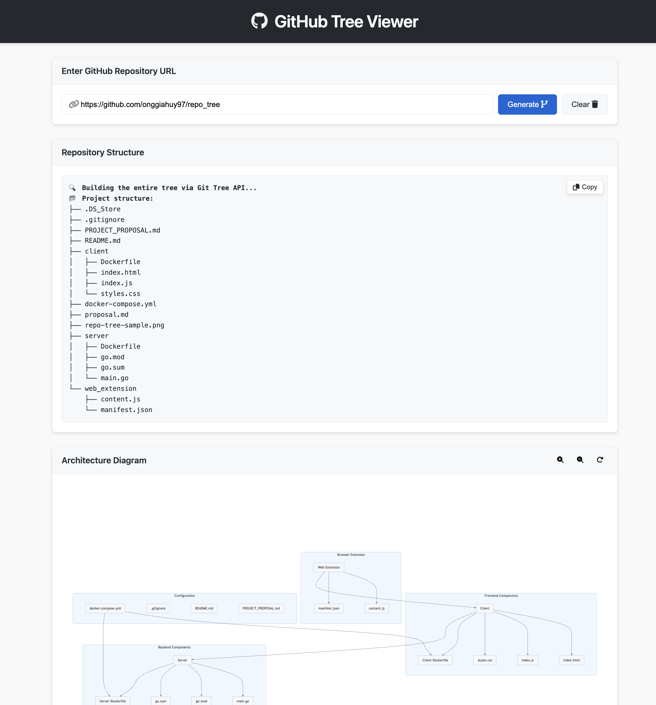

# Repo Tree Viewer

A simple **Go** server (with Docker support) that uses the **GitHub Tree API** to display a repository's file structure in ASCII-tree format. This project also includes a **client web app** that fetches and displays the tree data in a browser.



## Prerequisites

- **Go** (if running natively).
- **Docker** and **Docker Compose** (if running inside containers).

## Setup

1. **Clone** this repository to your machine.
2. Create a `.env` file in the **server** directory with your GitHub token:
   ```bash
   GITHUB_TOKEN=ghp_YourPersonalAccessToken
   ```
   This allows the app to authenticate requests to the GitHub API and avoid rate limits (especially for private repos).

## Running via Docker Compose

1. Ensure **Docker** and **Docker Compose** are installed.
2. Navigate to the project root (where `docker-compose.yml` resides).
3. Run:
   ```bash
   docker compose up --build
   ```
4. The **Go server** will be available on [http://localhost:8080](http://localhost:8080).
5. The **client web app** will be available on [http://localhost:8081](http://localhost:8081).

## Running Natively (Without Docker)

If you don’t have Docker installed, you can run the server and web app manually:

1. **Server** (Go code):
   - In the `server/` folder, build and run the Go application:
     ```bash
     go mod tidy  # Download all necessary Go dependencies
     go run main.go
     ```
   - The server listens on port `8080` by default.
2. **Client Web App**:
   - In the `client/` folder, you can serve the static files with any HTTP server.
   - For a quick test, you can use `php -S` or `python3 -m http.server`, etc.:
     ```bash
     # Using PHP's built-in server, for example:
     php -S 127.0.0.1:8081
     ```
   - Then open [http://127.0.0.1:8081](http://127.0.0.1:8081) in your browser.

Now you can **enter a GitHub URL** into the web app, click **Fetch**, and see the ASCII tree of the repo's contents.

---

### Notes & Next Steps

- Adjust the **CORS** settings or environment variables to match your setup if needed.
- Customize the Dockerfile to set the Apache `ServerName` or other configurations if you see warnings.
- Replace the placeholder image in this README with an actual screenshot of your application in action.
