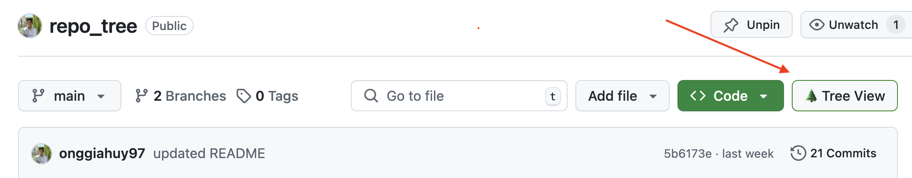

# GitHub Repository Tree Viewer

A tool that visualizes GitHub repository file structures in clean ASCII tree format and generates architecture diagrams.




## Table of Contents
- [Overview](#overview)
- [Features](#features)
- [Architecture](#architecture)
- [Installation](#installation)
- [Usage](#usage)
- [Development Setup](#development-setup)
- [API Documentation](#api-documentation)
- [Browser Extension](#browser-extension)
- [Future Enhancements](#future-enhancements)

## Overview

The GitHub Repository Tree Viewer allows developers to quickly visualize repository structures without downloading or cloning them. It provides a clean, ASCII-formatted tree output and AI-generated architecture diagrams to help understand project organization at a glance.

**Value for:**
- **Developers**: Quickly understand repository structure without downloading or cloning
- **Code Reviewers**: Easily assess code organization during pull request reviews
- **New Contributors**: Get a high-level overview of project organization

## Features

- **Clean ASCII Tree Visualization**: Convert repository structure into formatted tree output
- **Real-time Streaming**: Display tree results as they're generated
- **Copy-to-Clipboard**: Quick sharing of repository structure
- **Dark/Light Mode Toggle**: Customizable interface for user preference
- **Architectural Diagrams**: AI-generated Mermaid diagrams via Claude API
- **Browser Extension**: Direct integration with GitHub's interface
- **Responsive Design**: Works on desktop and mobile devices

## Architecture

The application consists of several components working together:

### Components

1. **Go Backend Server**:
   - Interfaces with GitHub API to fetch repository file structures
   - Converts repository data into formatted ASCII tree output
   - Integrates with Claude API to generate Mermaid diagrams
   - Handles API rate limiting and error cases

2. **Web Client**:
   - Responsive single-page application
   - Dark/light mode toggle for user preference
   - Copy-to-clipboard functionality
   - Live streaming of tree generation results
   - Interactive Mermaid.js diagram visualization with zoom and pan

3. **Browser Extension**:
   - Adds "🌲 Tree View" button to GitHub repository pages
   - Seamlessly integrates with the GitHub UI
   - Provides quick access to tree visualization of current repository

4. **Docker Deployment**:
   - Containerized setup for easy deployment
   - Separate containers for backend and frontend
   - Docker Compose configuration for orchestration

### Technical Stack

- **Backend**: Go (with GitHub API integration)
- **Frontend**: HTML, CSS, JavaScript (with Mermaid.js for diagrams)
- **Extension**: JavaScript (Browser Extension API)
- **Deployment**: Docker, Docker Compose

## Installation

### Prerequisites

- Go (for native development)
- Docker and Docker Compose (for containerized deployment)
- GitHub personal access token (for API authentication)

### Using Docker (Recommended)

1. Clone the repository:
   ```bash
   git clone https://github.com/yourusername/repo-tree.git
   cd repo-tree
   ```

2. Create a `.env` file in the server directory with your GitHub and Claude API tokens:
   ```
   GITHUB_TOKEN=your_github_token
   CLAUDE_API_KEY=your_claude_api_key
   ```

3. Start the containers:
   ```bash
   docker-compose up -d
   ```

4. Access the web application at `http://localhost:8081`

### Manual Installation

#### Backend Server

1. Navigate to the server directory:
   ```bash
   cd server
   ```

2. Install dependencies:
   ```bash
   go mod download
   ```

3. Create a `.env` file with your GitHub and Claude API tokens:
   ```
   GITHUB_TOKEN=your_github_token
   CLAUDE_API_KEY=your_claude_api_key
   ```

4. Run the server:
   ```bash
   go run main.go
   ```

#### Web Client

1. Navigate to the client directory:
   ```bash
   cd client
   ```

2. Serve the files using any static file server:
   ```bash
   # Example with Python
   python -m http.server 8081
   ```

## Usage

### Web Application

1. Open the web application at `http://localhost:8081`
2. Enter a GitHub repository URL (e.g., `https://github.com/username/repository`)
3. Click "Generate" to view the tree structure
4. The tree will be displayed in real-time as it's generated
5. Use the copy button to copy the tree to your clipboard
6. Toggle between dark and light mode using the switch in the header
7. View the AI-generated architecture diagram below the tree
8. Use zoom controls to zoom in/out of the diagram

### Browser Extension

1. Install the extension from the browser extension store or load it unpacked
2. Navigate to any GitHub repository
3. Click the "🌲 Tree View" button that appears on the repository page
4. The web application will open in a new tab with the repository structure

## Development Setup

### Project Structure

```
repo-tree/
├── client/             # Web client
│   ├── Dockerfile
│   ├── index.html      # Main HTML page
│   ├── index.js        # Client-side JavaScript
│   └── styles.css      # CSS styles
├── server/             # Go backend
│   ├── Dockerfile
│   ├── go.mod          # Go module definition
│   ├── go.sum          # Go dependencies
│   └── main.go         # Server implementation
├── web_extension/      # Browser extension
│   ├── content.js      # Extension JavaScript
│   └── manifest.json   # Extension manifest
├── docker-compose.yml  # Docker Compose configuration
└── README.md           # Project documentation
```

### Backend Development

The backend is implemented in Go and provides two main endpoints:
- `/tree` - Fetches the repository structure and returns an ASCII tree
- `/ai` - Generates a Mermaid diagram of the repository architecture

To run the backend in development mode:

```bash
cd server
go run main.go
```

### Frontend Development

The frontend is a simple HTML/CSS/JavaScript application that communicates with the backend API. To modify the frontend, edit the files in the `client` directory and refresh the browser.

### Browser Extension Development

The browser extension injects a button into GitHub repository pages that opens the web application with the current repository URL.

To load the extension in development mode:

**Chrome:**
1. Open `chrome://extensions/`
2. Enable Developer mode
3. Click "Load unpacked" and select the `web_extension` directory

**Firefox:**
1. Open `about:debugging#/runtime/this-firefox`
2. Click "Load Temporary Add-on..."
3. Select the `manifest.json` file in the `web_extension` directory

## API Documentation

### Tree Endpoint

```
GET /tree?repo={repository_url}
```

Parameters:
- `repo`: The GitHub repository URL (e.g., `https://github.com/username/repository`)

Response:
- Content-Type: `text/plain`
- Body: ASCII tree representation of the repository structure

### AI Diagram Endpoint

```
GET /ai?repo={repository_url}
```

Parameters:
- `repo`: The GitHub repository URL (e.g., `https://github.com/username/repository`)

Response:
- Content-Type: `application/json`
- Body: JSON object with a `diagram` field containing Mermaid diagram code

## Browser Extension

The browser extension adds a "🌲 Tree View" button to GitHub repository pages that opens the web application with the current repository URL.

### Installation

1. Download the extension files
2. Load the extension in your browser (see Development Setup section)

### Compatibility

- Chrome: version 80 or later
- Firefox: version 75 or later

## Future Enhancements

- Support for other Git platforms (GitLab, Bitbucket)
- Advanced filtering options for large repositories
- Repository comparison views
- Directory size visualization
- Integration with GitHub authentication for private repositories

---

&copy; 2025 GitHub Tree Viewer | Created by Huy Ong